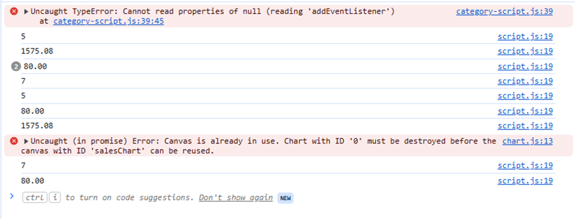
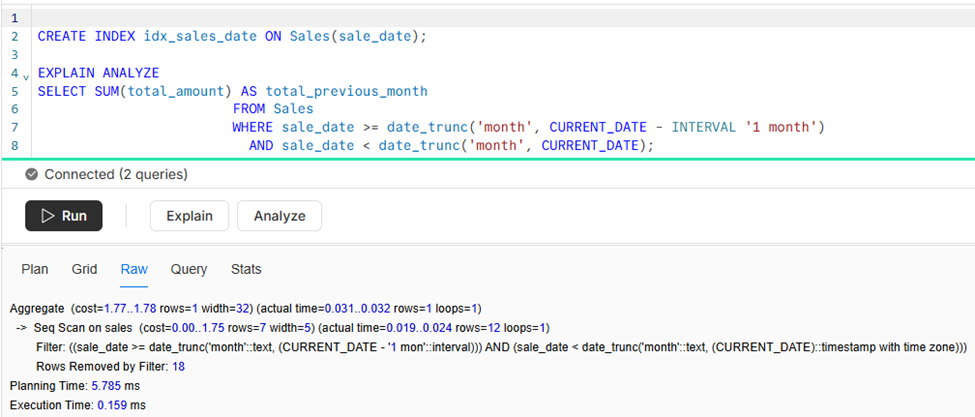
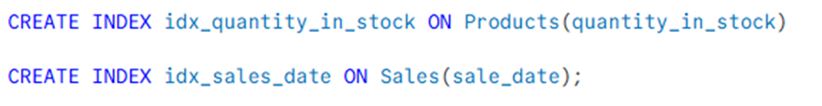
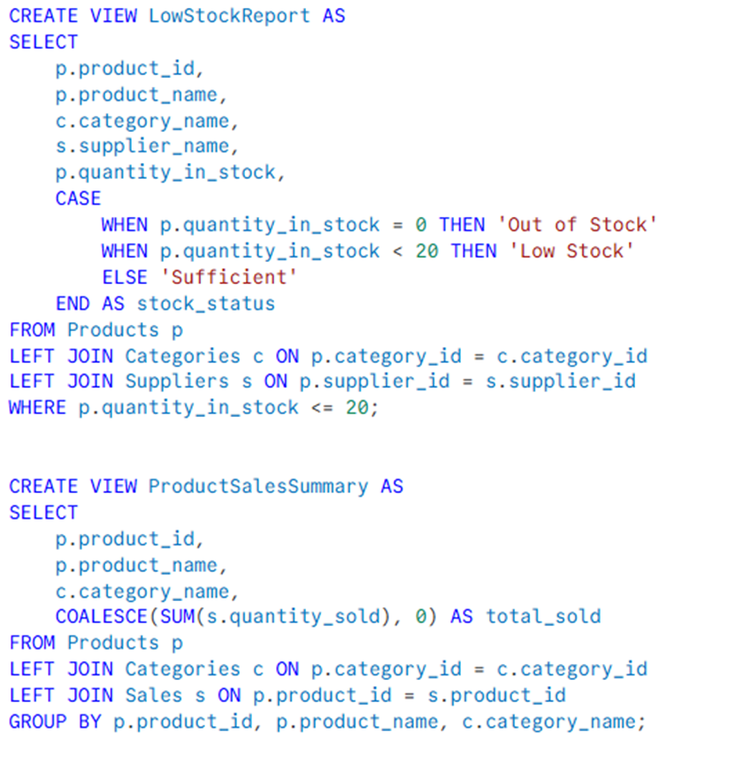
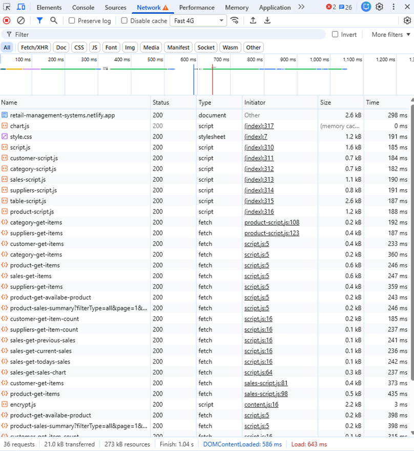

# Inventory Management System Documentation

## 1. System Overview
The inventory management system is designed to manage the inventory of a small retail store.  
It manages data, helps generate reports, and supports decision-making for future planning.  

Currently, the system includes five tables:
- **Customers**
- **Suppliers**
- **Categories**
- **Sales**
- **Products**

---

## 2. System Features
The system has six modules:
- **Home**, **Customer**, **Supplier**, **Category**, **Product**, **Sales**

### 2.1 Home Module (Dashboard)
The Home module provides an overview of key information:
- **Reports:** Number of customers, number of products, last month’s sales, current month’s sales, and today’s sales.  
- **Products Needing Restock:** Displays products that are low or out of stock.  
- **Product Sales Summary:** Shows product sales records filtered by *All*, *Above Average*, *Below Average*, or *No Sale*. Includes dynamic pagination.  
- **Sales Chart:** Visualizes the last three months’ product sales.  

### 2.2 Customer, Supplier, and Category Modules
- Create, view, edit, and delete records.  
- JavaScript search and pagination for easy lookup and navigation.  

### 2.3 Product Module
- Create, view, edit, and delete product records.  
- Advanced search by product name, category, or supplier.  
- JavaScript pagination included.  

### 2.4 Sales Module
- Add, view, and edit sales records.  
- Advanced filtering by date (All, Last 1 Week, Last 1 Month, Last 3 Months).  
- Sorting by sales date (ascending/descending).  
- JavaScript search and pagination included.  

### 2.5 Dynamic Dropdown
- Dropdown menus in **Sales** for selecting products/customers.  
- Dropdown menus in **Product** for selecting categories/suppliers.  
- Lists update automatically when changes are made in respective tables.  

### 2.6 Real-Time Updates
- Dashboard reports are instantly updated as soon as changes are made in tables.  

### Future Enhancements
- Expand database with additional tables  
- Implement structured response handling  
- Use advanced query techniques for efficiency  
- Add features such as:  
  - Detailed analytics  
  - Automated alerts  
  - Role-based access control

---

## 3. System Performance Report

### 3.1 DevTools Screenshots

### 3.2 ANALYZE Results Showing Improvements

### 3.3 List of Indexes Created

### 3.4 List of Views Created

### 3.5 Response time
